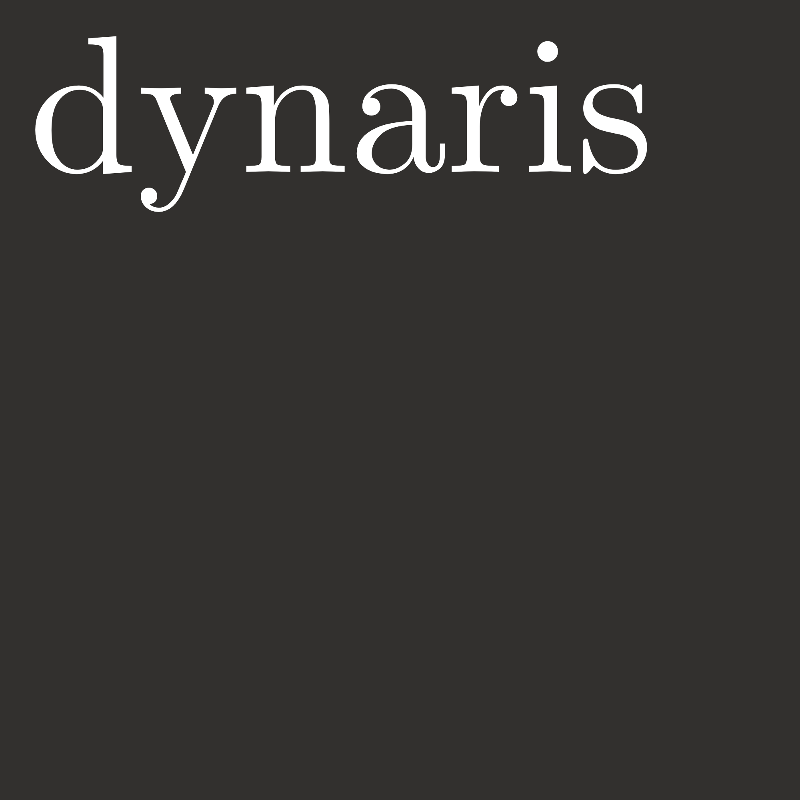

<h1 align="left">

</h1>

[](https://pypi.org/project/dynaris/)
[](https://github.com/quant-sci/dynaris/blob/main/LICENSE)


**dynaris** is a JAX-powered Python library for Dynamic Linear Models (DLMs).

[ROADMAP](ROADMAP.md)

## Installation

You can install the **dynaris** library using `uv`:

```bash
uv add dynaris
```

## Getting Started

```python
import dynaris
```

## License

This library is licensed under the [MIT License](LICENSE), allowing you to use, modify, and distribute it for both commercial and non-commercial purposes.

Start exploring the world of state-space models with the _dynaris_ library in Python!
